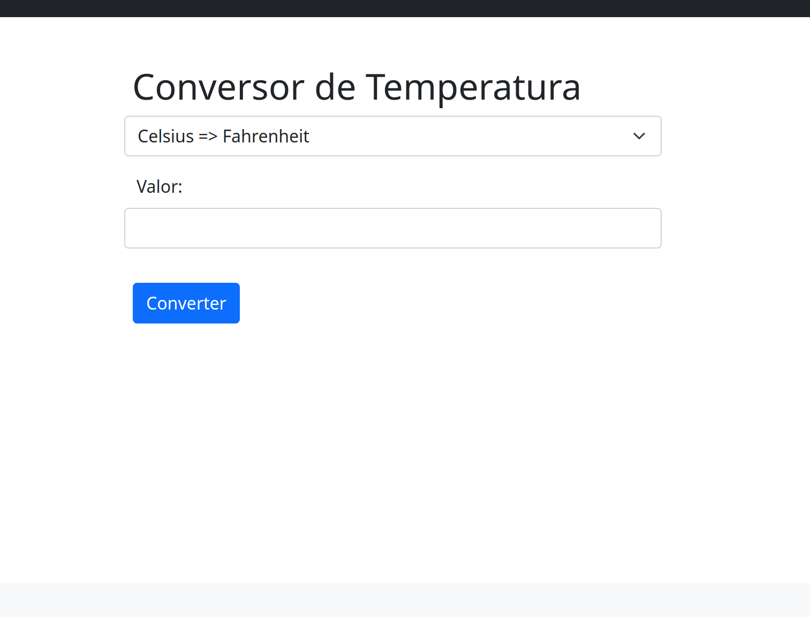

# Conversão de temperatura

## Sobre

Aplicação para converter Celsius em Fahrenheit e Fahrenheit em Celsius.

## Captura de tela



## Execução

Execute a aplicação:

```bash
node ./src/server.js
```

Acesse a aplicação na URL `http://localhost:8080`
